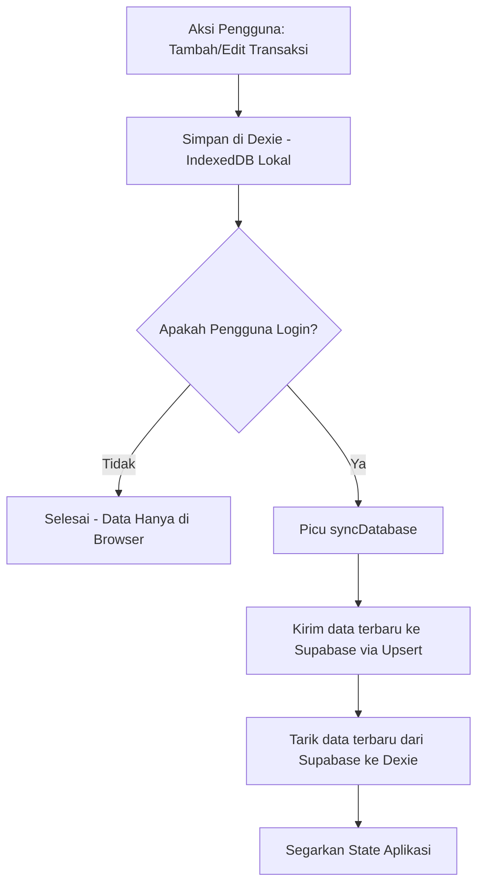

# Analisis Sistem CashFlow Tracker 💰

Dokumen ini berisi hasil analisis mendalam mengenai arsitektur, teknologi, alur sinkronisasi data, keamanan, serta temuan penting dalam proyek **CashFlow Tracker**.

---

## 📂 1. Gambaran Umum Proyek & Arsitektur

**CashFlow Tracker** adalah aplikasi manajemen keuangan pribadi berbasis **Next.js (App Router)** dan **React**. Aplikasi ini mengadopsi pendekatan **Offline-First** dengan sinkronisasi opsional ke **Supabase** (BaaS) saat pengguna masuk log.

### Tumpukan Teknologi (Tech Stack)
* **Frontend Framework**: Next.js 16.2.6 (App Router) & React 19.2.4
* **Bahasa**: TypeScript
* **Desain & Gaya**: Vanilla CSS dengan desain estetika modern **Neobrutalism** (berdasarkan berkas `globals.css` dan token desain khusus).
* **Database Lokal**: [Dexie.js](https://dexie.org/) (Wrapper IndexedDB) untuk menyimpan data di sisi klien secara persisten.
* **Backend & Autentikasi**: [Supabase](https://supabase.com/) untuk manajemen pengguna (auth) dan sinkronisasi basis data jarak jauh (remote sync).
* **Fitur Tambahan**: 
  * Grafik interaktif menggunakan **Chart.js** & `react-chartjs-2`.
  * Ekspor laporan ke PDF menggunakan `jspdf` & `jspdf-autotable`.

---

## 🔒 2. Konfigurasi Variabel Lingkungan (`.env`)

Untuk mendukung integrasi dengan Supabase, sistem ini memerlukan kredensial API. Kami telah menyiapkan berkas `.env` dan `.env.example` di direktori utama (*root*) proyek dengan variabel berikut:

| Nama Variabel | Cakupan | Deskripsi |
| :--- | :--- | :--- |
| `NEXT_PUBLIC_SUPABASE_URL` | Sisi Klien & Server | URL proyek Supabase Anda (misal: `https://xyz.supabase.co`). |
| `NEXT_PUBLIC_SUPABASE_ANON_KEY` | Sisi Klien & Server | Kunci API publik/anon untuk mengakses basis data dengan kebijakan RLS. |

> [!IMPORTANT]
> Kedua variabel ini menggunakan awalan `NEXT_PUBLIC_` karena digunakan langsung di sisi browser (`src/lib/supabase/client.ts`) untuk inisialisasi koneksi Supabase.

---

## 🔄 3. Alur Pengelolaan Data: Offline-First vs. Sync

Aplikasi ini menggunakan perpaduan unik antara database lokal dan jarak jauh:



### A. Penyimpanan Lokal (Offline-First)
Melalui `src/lib/db.ts`, aplikasi menginisialisasi IndexedDB bernama `CashFlowDB` menggunakan Dexie. Skema lokal meliputi:
* `transactions` (Transaksi pemasukan/pengeluaran)
* `categories` (Kategori default & kustom)
* `settings` (Konfigurasi mata uang & tema)
* `recurringTransactions` (Transaksi berulang otomatis)
* `budgets` (Anggaran bulanan per kategori)

### B. Sinkronisasi Awan (Supabase Sync)
Ketika pengguna masuk log, fungsi `syncDatabase()` di `src/lib/sync.ts` dijalankan di latar belakang (*background sync*):
1. Mengambil data transaksi dan pengaturan dari lokal (Dexie).
2. Membandingkan penanda waktu (`updatedAt` / `createdAt`) antara lokal dan server.
3. Melakukan **Upsert** ke tabel Supabase jika data lokal lebih baru.
4. Mengunduh data dari server dan memperbarui database lokal jika data server lebih baru.

---

## 🗄️ 4. Skema Database Supabase (`database.sql`)

Untuk mendukung sinkronisasi awan, skema database relasional di Supabase dikonfigurasi melalui berkas `database.sql` dengan detail berikut:

1. **`profiles`**: Menyimpan data profil pengguna (nama lengkap, avatar) yang terhubung dengan `auth.users` di Supabase.
2. **`transactions`**: Menyimpan riwayat transaksi keuangan pengguna, terhubung dengan `auth.users(id)` melalui kolom `user_id`.
3. **`settings`**: Menyimpan preferensi default pengguna (mata uang utama, tema aktif).

### Keamanan Data (Row Level Security - RLS)
All tables in Supabase require RLS for data protection:
```sql
CREATE POLICY "Users can manage their own transactions" ON transactions
  FOR ALL USING (auth.uid() = user_id);
```

---

## ⚠️ 5. Temuan Penting & Konfigurasi Cloudflare (OpenNext)

Berikut adalah ringkasan temuan dan penyesuaian yang telah kami lakukan untuk kelancaran deployment ke Cloudflare Workers:

### A. Konvensi Proxy/Middleware pada Next.js 16 & Cloudflare
* **Temuan**: Next.js 16 mendepresiasi berkas `middleware.ts` dan menggantinya dengan berkas `src/proxy.ts` (dengan nama fungsi `proxy`). File ini diatur oleh Next.js untuk selalu berjalan pada runtime Node.js dan tidak mendukung Edge Runtime.
* **Masalah**: Cloudflare Workers tidak mendukung middleware berbasis Node.js penuh pada perantara permintaannya, sehingga OpenNext gagal memaketkan aplikasi ketika `src/proxy.ts` aktif.
* **Solusi**: Kami telah menonaktifkan berkas tersebut sementara dengan mengubah namanya menjadi `src/proxy.ts.bak`. Untuk keamanan akses halaman, rute proteksi dialihkan ke pengecekan berbasis sisi klien (client-side) di dalam aplikasi React, yang sangat cocok untuk arsitektur offline-first ini.

### B. Perbaikan TypeScript Compiler
* **Masalah**: Proses build gagal akibat kesalahan tipe data di file sinkronisasi `src/lib/sync.ts` dan tipe `AppSettings` di `src/lib/types.ts`.
* **Solusi**:
  1. Menambahkan atribut opsional `updatedAt?: string` di interface `AppSettings`.
  2. Mengubah spesifikasi fungsi `addLocal` dan `updateLocal` di signature `syncTable` untuk menerima `Promise<any>`.
  3. Mengatur instansiasi `serverMap` secara eksplisit menjadi `new Map<any, any>` agar mempermudah compiler membaca properti dinamis.

---

## 🚀 Cara Menjalankan Aplikasi & Deploy

1. **Setup Database Supabase**: Jalankan kueri SQL di dalam berkas `database.sql` di SQL Editor pada Dashboard Supabase Anda.
2. **Konfigurasi Kunci Supabase**: Isi berkas `.env` yang baru dibuat dengan kunci API dari Dashboard Supabase Anda.
3. **Jalankan Lokal**:
   ```bash
   npm install
   npm run dev
   ```
4. **Deploy ke Cloudflare**:
   ```bash
   # Build proyek untuk Cloudflare
   npm run build:cf

   # Hubungkan Wrangler ke akun Cloudflare Anda
   npx wrangler login

   # Deploy ke Workers
   npm run deploy
   ```
